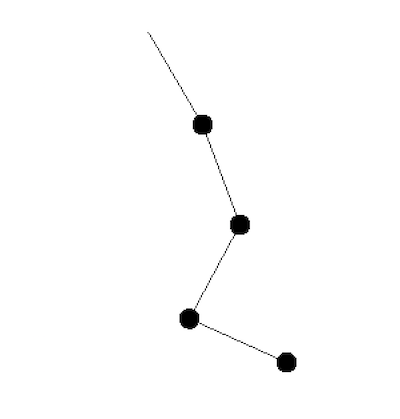

n重振り子のシミュレーション
===========================



```
.
├── app
│   └── Main.hs -- ここに定義されてる数字をいじるとn重振り子のnを変えれます
└── src
    └── Pendulum
        ├── Model.hs -- n重振り子のデータ構造の定義と hamilton 用の関数の定義
        └── View.hs  -- n重振り子を描画する関数
```
